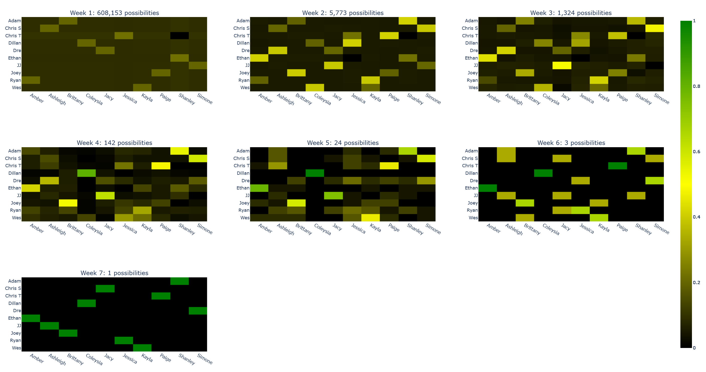

# Are You The One
A brute force simulation of all possibilities for the show "Are You The One?"

## Usage
Run the main script with a season as input:

```sh
python -m main s1
```

Given data about a season, produces a visualization similar to the one below, where each heatmap represents the probabilities of an individual matchup for that week:

